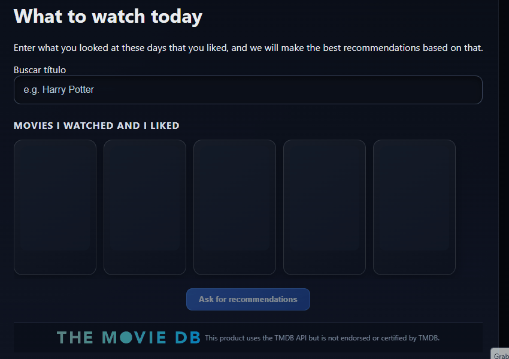
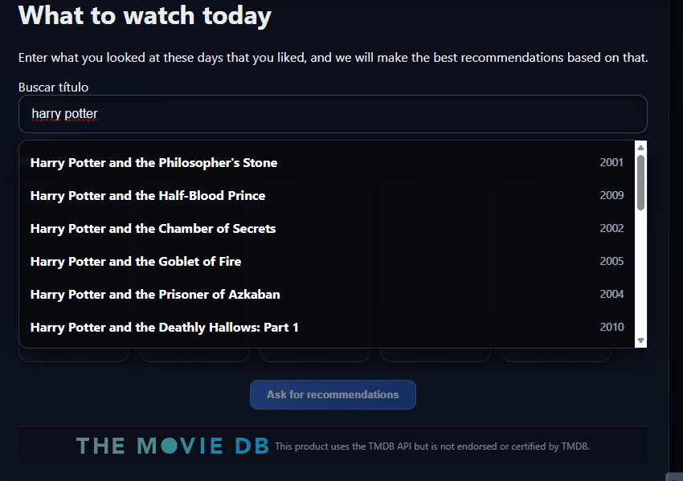
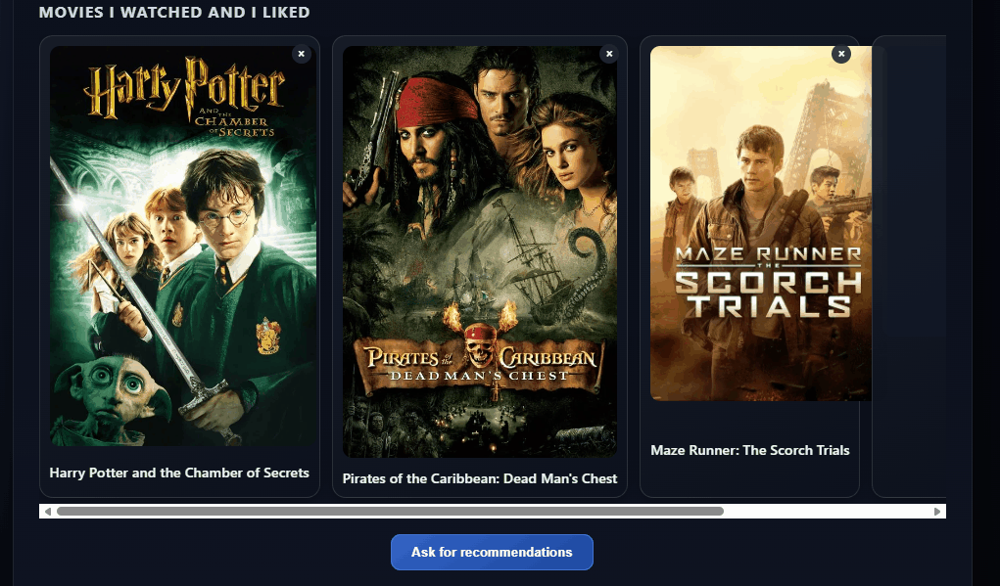

# AI Movie Recommendation System

A full-stack movie recommendation application that uses an LLM to suggest movies based on user preferences.
Users can select movies they liked and receive AI-powered recommendations with explanations.
AI recommendations are generated using a local LLM via Ollama.

Redis caching is used to:
- cache movie search results
- reduce calls to the TMDB API
- improve response time

## Features
- Movie search with TMDB API
- AI-based recommendations
- Redis caching

## Tech Stack
Frontend
- React
- TypeScript

Backend
- Node.js
- Express

AI
- Ollama (Llama3)

Caching
- Redis

External APIs
- TMDB API

## Architecture
Frontend
   ↓
Express API
   ↓
Services Layer
   ↓
TMDB API
Redis Cache
LLM (Ollama)

## Screenshots

## Gifs
